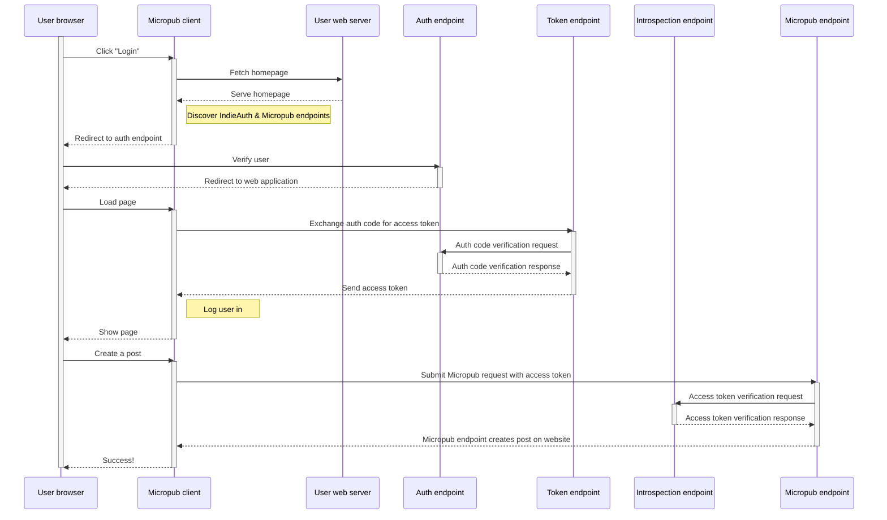

<Transform scale="0.9">

```mermaid
sequenceDiagram
    participant UB as User browser
    participant MC as Micropub client
    participant WS as User web server
    participant AE as Auth endpoint
    participant TE as Token endpoint
    participant IE as Introspection endpoint
    participant ME as Micropub endpoint

    activate UB
    UB->>MC: Click "Login"
    activate MC
    MC->>WS: Fetch homepage
    WS-->>MC: Serve homepage
    Note right of MC: Discover IndieAuth & Micropub endpoints
    MC-->>UB: Redirect to auth endpoint
    deactivate MC
    UB->>AE: Verify user
    activate AE
    AE-->>UB: Redirect to web application
    deactivate AE
    UB->>MC: Load page
    activate MC
    MC->>TE: Exchange auth code for access token
    activate TE
    TE->>AE: Auth code verification request
    activate AE
    AE-->>TE: Auth code verification response
    deactivate AE
    TE-->>MC: Send access token
    deactivate TE
    Note right of MC: Log user in
    MC-->>UB: Show page
    deactivate MC
    UB->>MC: Create a post
    activate MC
    MC->>ME: Submit Micropub request with access token
    activate ME
    ME->>IE: Access token verification request
    activate IE
    IE-->>ME: Access token verification response
    deactivate IE
    ME-->>MC: Micropub endpoint creates post on website
    deactivate ME
    MC-->>UB: Success!
    deactivate MC
    deactivate UB
```

</Transform>
